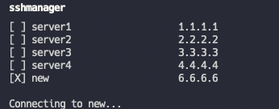

# SSH Manager
Manage your SSH servers easily in terminal.

## Commands
* `list` - Take a look at all of your saved SSH connections.
* `add` - Add new SSH connection.
* `remove` - Remove existing SSH connection.
* `update` - Update existing SSH connection.

## Example
Add new connection:


Connect:



## How to install
### Linux
Compile `sshmanager.sh` script:
```shell
shc -f sshmanager.sh
```
Rename executable:
```shell
mv sshmanager.sh.x sshmanager
```
Add root directory to `$PATH` or move executable to `/bin`
### Mac OS
`zsh` does not support every feature in this script, so I suggest creating alias in `~/.zshrc`:
```shell
alias sshmanager="bash <PATH_TO_SCRIPT>"
```
